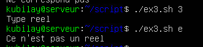
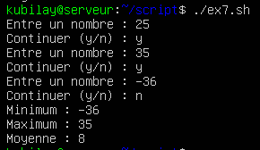

# TP 2 - Bash
## Kubilay Kaplan

## Exercice 1. Variables d’environnement
1. Dans quels dossiers bash trouve-t-il les commandes tapées par l’utilisateur ?
```
printenv PATH   
```
2. Quelle variable d’environnement permet à la commande cd tapée sans argument de vous ramener dans
votre répertoire personnel ?
```
cd $HOME
```  
3. Explicitez le rôle des variables LANG, PWD, OLDPWD, SHELL.
```
La variable d’environnement LANG : la langue que les logiciels et utilisateurs utilisent.  
PWD : affiche du dossier courant.   
OLDPWD : affiche le dossier courant ou l'on etait avant.   
SHELL : affiche le shell utilisé (/bin/bash)  
```
4. Créez une variable locale MY_VAR (le contenu n’a pas d’importance). Vérifiez que la variable existe.
```
MY_VAR="abde"
echo $MY_VAR affiche bien "abde"  
```
5. Tapez ensuite la commande bash. Que fait-elle ? La variable MY_VAR existe-t-elle ? Expliquez. A la fin
de cette question, tapez la commande exit pour revenir dans votre session initiale.
```
Non elle n'existe plus car la commande "bash" a ouvert une nouvelle session dans laquelle ma variable n'existe pas, c'etait une variable locale de la précedente session.  
```
6. Transformez MY_VAR en une variable d’environnement et recommencez la question précédente. Expliquez.
```
On utilise `export`.  
La variable existe toujours apres bash car elle est maintenant permanante. Elle est presente a chaque demarage de bash.  
```
7. Créer la variable d’environnement NOMS ayant pour contenu vos noms de binômes séparés par un espace.
Afficher la valeur de NOMS pour vérifier que l’affectation est correcte.
```
export NOMS="kubilay emile" ; printenv NOMS
Elle affiche bien le contenu de la variable.
```
8. Ecrivez une commande qui affiche ”Bonjour à vous deux, binôme1 binôme2 !” (où binôme1 et binôme2
sont vos deux noms) en utilisant la variable NOMS.
```
echo "Bonjour a vous deux, $NOMS !"
```
9. Quelle différence y a-t-il entre donner une valeur vide à une variable et l’utilisation de la commande
unset ?
```
Une variable vide existe meme si elle est vide. Alors que avec unset efface de la memoire la variables passées en paramètre.
```
10. Utilisez la commande echo pour écrire exactement la phrase : $HOME = chemin (où chemin est votre
dossier personnel d’après bash)
```
echo "$HOME = chemin (votre dossier d'apres bash)"
```
## Programmation Bash
Vous enregistrerez vos scripts dans un dossier script que vous créerez dans votre répertoire personnel.  
Tous les scripts sont bien entendu à tester.  
Ajoutez le chemin vers script à votre PATH de manière permanente
```
PATH=$PATH:~/script on l'ajoute dans bashrc
```
## Exercice 2. Contrôle de mot de passe
Écrivez un script testpwd.sh qui demande de saisir un mot de passe et vérifie s’il correspond ou non au
contenu d’une variable PASSWORD dont le contenu est codé en dur dans le script. Le mot de passe saisi par
l’utilisateur ne doit pas s’afficher.
```
touch testpwd.sh
nano testpwd.sh
chmod u+x testpwd.sh
```
```bash
#!/bin/bash

PASSWORD="123"
read -p 'Saisissez un mdp' m
if [ x$PASSWORD = x$m ]; then
 echo "Correspond"
else
 echo "Ne correspond pas"
fi
```


## Exercice 3. Expressions rationnelles
Ecrivez un script qui prend un paramètre et utilise la fonction suivante pour vérifier que ce paramètre est un nombre réel. Il affichera un message d’erreur dans le cas contraire.
```
touch ex3.sh
nano ex3.sh 
chmod u+x ex3.sh
```
```bash
#!/bin/bash

function is_number()
{
  re='^[+-]?[0-9]+([.][0-9]+)?$'

  if ! [[ $1 =~ $re ]] ; then
     return 1
  else
     return 0
  fi
}

is_number $1
nbr=$?

if [ $nbr -eq 0 ]; then
  echo "Type reel"
else
  echo "Ce n'est pas un reel"
fi
```

## Exercice 4. Contrôle d’utilisateur
Écrivez un script qui vérifie l’existence d’un utilisateur dont le nom est donné en paramètre du script. Si le
script est appelé sans nom d’utilisateur, il affiche le message : ”Utilisation : nom_du_script nom_utilisateur”,
où nom_du_script est le nom de votre script récupéré automatiquement (si vous changez le nom de votre
script, le message doit changer automatiquement)
```
touch ex4.sh
nano ex4.sh
chmod u+x ex4.sh
```
```bash
#!/bin/bash

DOCNAME="${0##*/}"

if [ -z $1 ]; then
  echo "Utilisation : $DOCNAME nom_utilisateur"
else
  if [ $(id -u $1 -u 2> /dev/null ) ];then
    echo "L'utilisateur est connu"
  else
    echo "L'utilsateur n'est pas connu"
  fi
fi
```


## Exercice 5. Factorielle
Écrivez un programme qui calcule la factorielle d’un entier naturel passé en paramètre (on supposera que
l’utilisateur saisit toujours un entier naturel).
```bash
#!/bin/bash

number=$1
somme=1
while [ $number -gt 0 ]
do
        somme=$(( $somme * $number ))
        number=$(( $number - 1 ))
done
echo $somme
```

## Exercice 6. Le juste prix
Écrivez un script qui génère un nombre aléatoire entre 1 et 1000 et demande à l’utilisateur de le deviner.
Le programme écrira ”C’est plus !”, ”C’est moins !” ou ”Gagné !” selon les cas (vous utiliserez $RANDOM).
```bash
#!/bin/bash

random=$((1+ RANDOM % 1000))

read -p 'Saisissez un nombre entre 1 et 1000 : ' number

while [ $number -ne $random ]
do
        if [ $number -gt $random ]; then
                echo "C'est moins"
                read -p 'Saisissez un nombre entre 1 et 1000 : ' number
        elif [ $number -lt $random ]; then
                echo "C'est plus"
                read -p 'Saisissez un nombre entre 1 et 1000: ' number
        fi
done
echo "Gagné !!"
```

## Exercice 7. Statistiques
1. Écrivez un script qui prend en paramètres trois entiers (entre -100 et +100) et affiche le min, le max
et la moyenne. Vous pouvez réutiliser la fonction de l’exercice 3 pour vous assurer que les paramètres
sont bien des entiers.  
```bash

#!/bin/bash

function is_number()
{
        re='^[+-]?[0-9]+([.][0-9]+)?$'
        if ! [[ $1 =~ $re ]]; then
                return 1
        else
                return 0
        fi
}

MIN=$1
MAX=$1
for i in $(seq 1 3)
do
       is_number ${!i}
        nbr=$?
        if [[ $nbr -eq 0 && ${!i} -lt 100 && ${!i} -gt -100 ]]; then
                if [ ${!i} -lt $MIN ]; then
                        MIN=${!i}
                fi
                if [ ${!i} -gt $MAX ]; then
                        MAX=${!i}
                fi
                MOY=$(($MOY + ${!i}))
        else
                echo "Verifier que ${!i} est un entier et est compris entre -10>
                exit 1
        fi
done
MOY=$(($MOY/$#))
echo "Minimum : $MIN"
echo "Maximum : $MAX"
echo "Moyenne : $MOY"
```


2. Généralisez le programme à un nombre quelconque de paramètres (pensez à SHIFT)
```bash

#!/bin/bash
function is_number()
{
        re='^[+-]?[0-9]+([.][0-9]+)?$'
        if ! [[ $1 =~ $re ]]; then
                return 1
        else
                return 0
        fi
}

MIN=$1
MAX=$1
for i in $(seq 1 $#)
do
        is_number ${!i}
        nbr=$?
        if [[ $nbr -eq 0 && ${!i} -lt 100 && ${!i} -gt -100 ]]; then
                if [ ${!i} -lt $MIN ]; then
                        MIN=${!i}
                fi
                if [ ${!i} -gt $MAX ]; then
                        MAX=${!i}
                fi
                MOY=$(($MOY + ${!i}))
        else
                echo "Verifier que ${!i} est un entier et est compris entre -100 et 100"
                exit 1
        fi
done
MOY=$(($MOY/$#))
echo "Minimum : $MIN"
echo "Maximum : $MAX"
echo "Moyenne : $MOY"
```


3. Modifiez votre programme pour que les notes ne soient plus données en paramètres, mais saisies et
stockées au fur et à mesure dans un tableau.  
```bash
#!/bin/bash

function is_number()
{
        re='^[+-]?[0-9]+([.][0-9]+)?$'
        if ! [[ $1 =~ $re ]]; then
                return 1
        else
                return 0
        fi
}

continu="y"
index=0
tab=()

while [ x$continu = x"y" ]
do
    read -p "Entre un nombre : " tab[$(($index))]
    index=$(($index+1))
    read -p "Continuer (y/n) : " continu
done
MAX=${tab[1]}
MIN=${tab[1]}

for i in ${tab[@]}
do

        is_number $i
        nbr=$?
        if [[ $nbr -eq 0 && $i -lt 100 && $i -gt -100 ]]; then
                if [ $i -lt $MIN ]; then
                        MIN=$i
                fi
                if [ $i -gt $MAX ]; then
                        MAX=$i
                fi
                MOY=$(($MOY + $i))
        else
                echo "Verifier que ${!i} est un entier et est compris entre -100 et 100"
                exit 1
        fi
done
MOY=$(($MOY/${#tab[@]}))
echo "Minimum : $MIN"
echo "Maximum : $MAX"
echo "Moyenne : $MOY"
```

